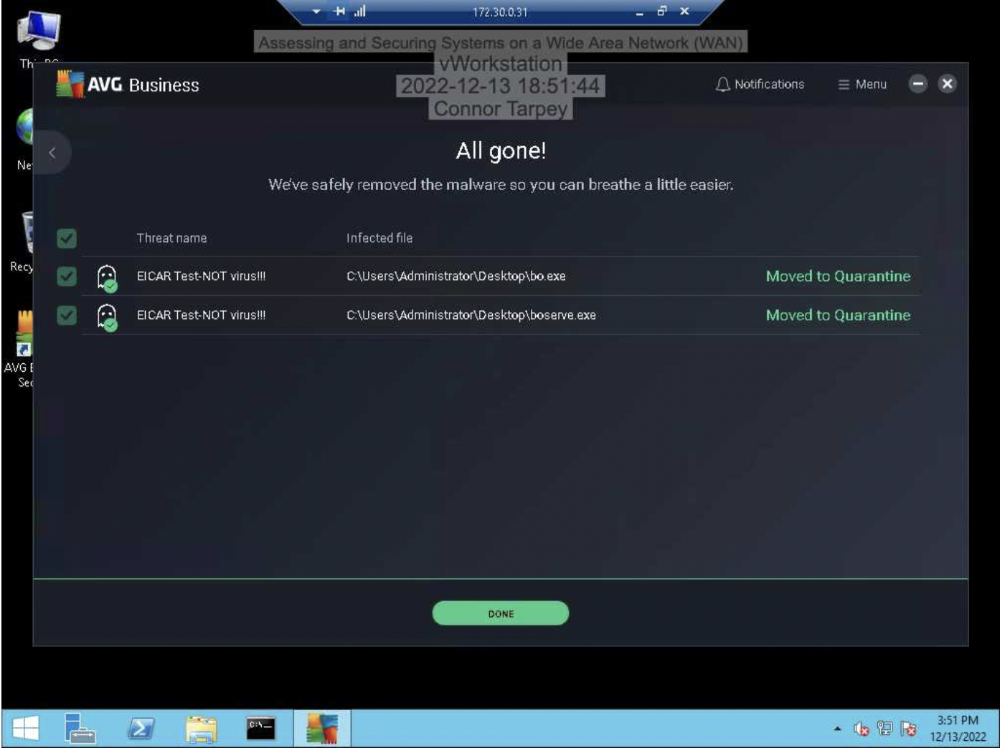

# Assessing and Securing Systems on a Wide Area Network (WAN)

## Overview
This project demonstrates how to assess, remediate, and harden systems across a simulated Wide Area Network (WAN). The lab focused on identifying exposed services with Nmap, removing malware from vulnerable hosts, and reducing attack surface through Windows Firewall configuration.

## Tools Used
- Nmap
- ClamWin Antivirus
- AVG Antivirus
- Windows Firewall
- Windows Server lab environment

## Objective
The goal of this lab was to scan WAN-connected systems, identify security risks, remove malware, and validate that firewall hardening reduced exposed services.

## Lab Environment
- Multiple WAN-connected target systems
- Windows 2003 Server
- Windows Server 2008 / Windows workstation environment
- Simulated enterprise network

## What I Did
- Used Nmap to perform OS detection and identify open ports across multiple remote systems.
- Scanned for high-risk exposed services, including SMB, RDP, SSH, and HTTP.
- Used Nmap scripting to check for known SMB-related vulnerabilities.
- Removed malware from vulnerable Windows hosts using antivirus tools.
- Configured Windows Firewall rules to reduce exposed services.
- Re-ran scans after hardening to validate reduced attack surface.

## Key Findings
- Initial scans revealed multiple exposed ports across vulnerable systems.
- One Windows 2003 system exposed six open ports, including SMB and RDP.
- After firewall hardening, the system’s exposed services were reduced significantly.
- Follow-up scans showed that only RDP remained accessible in the hardened configuration.
- Restricting inbound firewall rules made OS detection and service enumeration more difficult.

## Screenshots

### Initial Nmap Scan – Windows 2003 Host

### Initial Nmap Scan – Windows 2008 Host

### Malware Remediation with AVG

### Windows Firewall Hardening

### Post-Hardening Validation Scan
